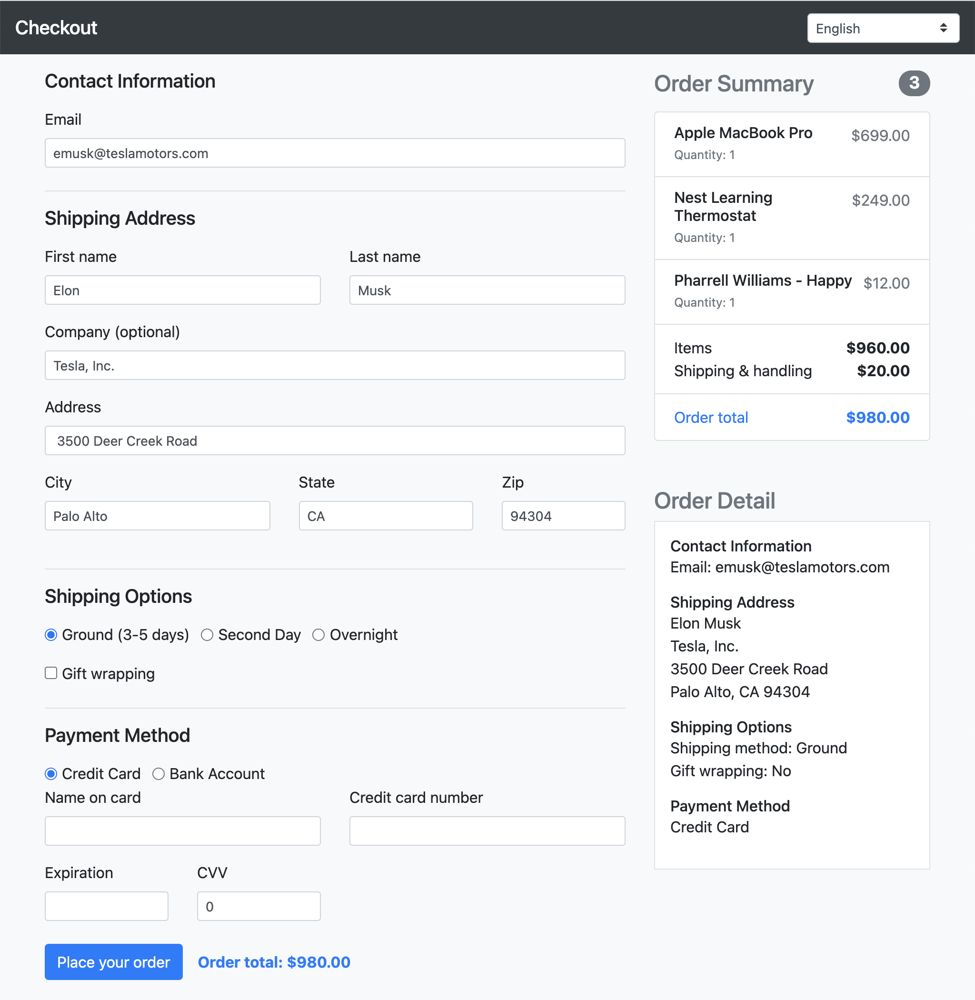

# Checkout Form | React Hook Form

This example illustrates best practices in creating large complex forms using
[React Hook Form](https://react-hook-form.com/). The use case is a checkout form
for an online order. It represents a good mix of challenges that you may
encounter when creating your own large complex form. For example,

1. How to break a large monolithic form into smaller "sub-forms" that you can
   test independently?
2. How to create reusable sub-forms that can be composed in different ways to
   target multiple use cases?
3. How to do conditional validation, e.g. changing validations dynamically based
   on the payment method?
4. How to break large validation schemas into smaller composable schemas?



## Getting Started

Execute the following commands to build and run the example.

```bash
$ yarn
$ yarn start
```

Now point your browser to http://localhost:3000/.

## Running Storybook

To understand the behavior of individual components and sub-forms, run them
independently in Storybook:

```bash
$ yarn storybook
```
